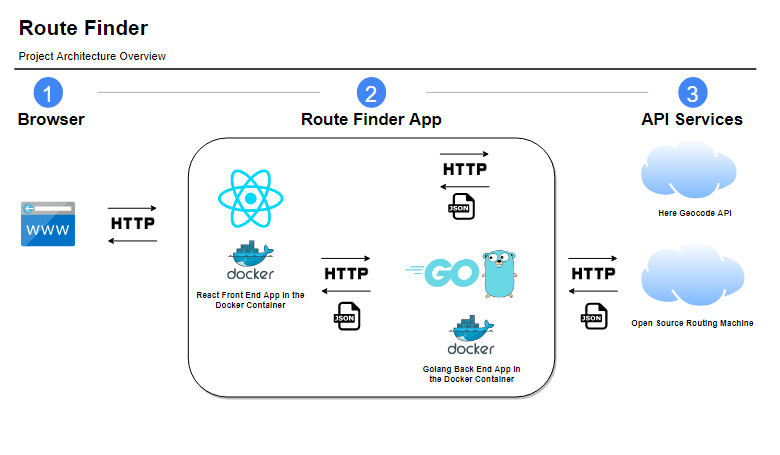

# Route Finder

The project helps users to get information about the source and destination(s) points in the form of latitude and longitude and receive data about duration and distance between those.

The route resolution by geographical coordinates is implemented in the Back End side by consuming the **[Open Source Routing Machine](http://project-osrm.org/)** API.

Users can also search for coordinates by the name location. This part is fully implemented in the Front End side by consuming the **[HERE Geocoding & Search](https://developer.here.com/products/geocoding-and-search)** API.

The Route Finder project consists of two separated applications: Front End (React JS) and Back End (Golang).



Child repositories:
- https://github.com/ioanzicu/go-route-finder
- https://github.com/ioanzicu/route-finder-front-end

### Prerequisites:

- [Docker Desktop](https://www.docker.com/products/docker-desktop)

## Clone the repository on your computer

```bash
git clone https://github.com/ioanzicu/route-finder-project.git
```

## Run the application using docker-compose.yml file

Before trying to run the application, start the docker desktop application.

Navigate into the project root folder:

```bash
cd route-finder-project
```

Build and run the docker compose contianers

```bash
docker-compose up --build
```

This command will build client and server docker containers.

To stop the docker-compose use the following combination `Ctrl + C`

## Access the shell in the running container

```bash
docker-compose exec [SERVICE NAME] sh
```

Example:

```bash
docker-compose exec server sh
```

## Shut down the docker-compose containers

```bash
docker-compose down
```

This command will open the prompt command line that start with `#`.

To exit from the container shell, enter `exit`.
